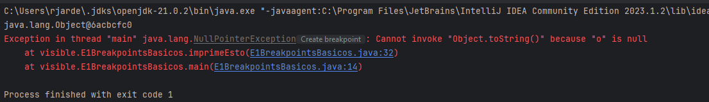
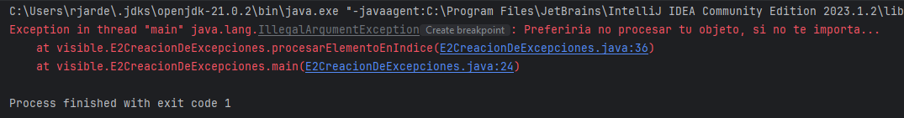
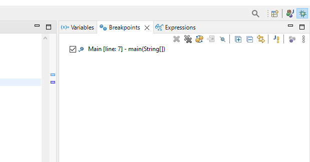
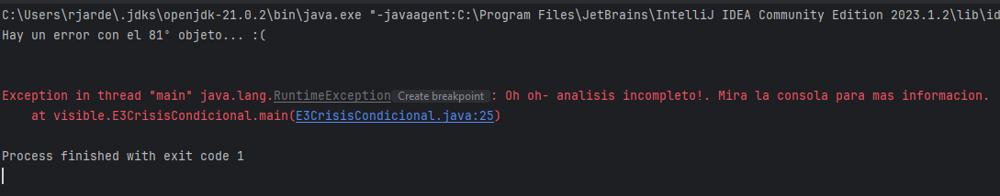

## Sobre los ejercicios
Tener en cuenta que el código fuente se divide en dos paquetes:

* `visible` - código fuente para uso e inspección en ejercicios de resolución de problemas.
  Estas son las clases destinadas a la inspección y el establecimiento de breakpoints.
* `noMirar` - una "caja negra" simulada de métodos de utilidad. Estas clases no están
  destinado a la inspección.

El 'Troubleshooting' es el arte de determinar la causa y/o ubicación de un problema.
Si tienes un conocimiento completo y perfecto del código entonces no es realmente necesario
para solucionar problemas, ya que es trivial ver por qué algo se comporta incorrectamente.

La inspección del paquete `noMirar` normalmente te permitirá realizar el "troubleshoot" fácilmente en un ejercicio
sin utilizar la técnica prevista.

Recuerda que el objetivo de estos ejercicios no es resolver los problemas, sino aprender
cómo y cuándo utilizar la gran variedad de técnicas de "troubleshooting" disponibles.

## Qué no hacer: escribir prints
Muchos desarrolladores lo primero que hacen es imprimir instrucciones.
Es fácil apoyarse en las impresiones como apoyo de seguridad: no necesita ningún
conocimiento para usarlos y, a menudo, trabajan para responder preguntas comunes (por ejemplo, "¿por qué es esto?"
¿variable nula aquí?", "¿cuántos elementos hay en mi matriz aquí?").

Sin embargo, hay desventajas críticas al intentar depurar mediante "prints":

* Son lentos. Si te das cuenta de que necesitas mover o añadir un "print", necesitas recompilar y relanzar tu aplicacion.
* Son parte del código. Añadir "prints" cambia el número de líneas, hace que git guarde los cambios y puede afectar al
  rendimiento y/o comportamiento
* Son limitados. Hasta el más básico breakpoint y expresión evaluada en el modo debug de tu IDE
  te da más poder y flexibilidad contra los "prints"

## Instrucciones generales
El objetivo de estos ejercicios no es resolver los problemas, sino desarrollar tu caja de herramientas de técnicas de 
resolución de problemas y desarrollar tu intuición sobre cuándo aplicar cada técnica. Una vez que aprendas a depurar una
aplicación Java, tendrás el conocimiento para aplicar cualquiera de estas técnicas a cualquier aplicación rica y compleja.

Debéis considerar el paquete `noMirar` como una librería externa sobre la que no tienes control o acceso al código fuente.

Cambiar el código fuente para arreglar los bugs está fuera del alcance de los ejercicios, pero si estais lo suficientemente
motivados puedes modificar el código fuente como te parezca.

Si en algún momento necesitas revertir los cambios, siempre puedes hacerlo mediante el comando:

```
git reset --hard origin/master
```

# Ejercicios

## Ejercicio 1: Trazas y Breakpoints

**Metas**

* Interpretar una traza
* Practicar estableciendo breakpoints en IntelliJ/Eclipse
* Usar la ventana de variables para inspeccionar los valores de las variables
* Usar los comandos de navegación de código en modo Debug

Los "breakpoints" son una herramienta fundamental en la depuración. Proporcionan una forma de indicarle a Java que detenga 
la ejecución de código cuando se encuentra una determinada línea de código, lo que brinda la oportunidad de explorar el 
código que se ejecuta en ese momento.

Para empezar en este ejercicio, abre el fichero ``E1BreakpointsBasicos``, y
ejecútalo para hacernos una idea de lo que está pasando. Deberíamos ver una simple traza en la consola:




Las trazas son un punto de partida común para la depuración, ya que normalmente se generan automáticamente cuando algo 
sale mal y el programa no estaba preparado para manejar el problema.

Los programas Java se ejecutan en orden "Last in, First out" es decir, comenzando con el método "main", a medida que se
llaman los métodos, se agregan a la parte superior de la pila, el método en la parte superior es el que se está ejecutando
actualmente y, cuando un método se completa, se elimina de la pila, volviendo al programa en el siguiente método de la pila.

Cuando ocurre una excepción, se imprime un seguimiento de la pila, que muestra el orden en que los métodos se han puesto
en cola, siendo la parte superior de la pila la ubicación de la excepción (y, por lo tanto, un lugar probable para comenzar
a buscar problemas)

Volviendo a las trazas que hemos obtenido, podemos observar lo que ha ido mal (hemos intentado usar un objeto nulo) y donde
ha ocurrido (el número de línea de la cima de las trazas), pero no sabemos por qué el objeto era nulo en ese punto - lo 
que sería la verdadera raíz de la causa de la excepción

Para investigar más, intenta completar los siguientes pasos de depuración:

1. Pon un breakpoint en el metodo main, antes de llamar a``hazUnObjeto``
2. Depura ``E1BreakpointsBasicos.main()``.
3. Cuando el breakpoint se encuentre, haz "step in" en el método``hazUnObjeto()`` 
4. Haz "Step over" sobre las líneas que construyen un objeto e imprimen la variable ``o``
5. Haz "Step out" del método ``hazUnObjeto()``
6. Haz "Step" a la próxima línea dentro del método ``main()``
7. En la ventana de variables, comprueba el valor de la variable ``o``
8. Haz "Resume execution" hasta que el programa termine

Ahora que has pasado por todo el programa ¿Sabes por qué hemos obtenido un ``NullPointerException``

**Conclusiones**

* Las trazas son útiles para identificar los puntos donde empezar la depuración
* La vista de Debug nos permite ejecutar el programa línea a línea e inspeccionar el valor de las variables para detectar
errores

## Ejercicio 2: Excepciones

**Metas**

* Establecer breakpoints en la creación de excepciones

Aunque las excepciones nos dan la oportunidad de investigar dentro del código que corre, a veces no está tan claro donde
empezar a mirar. Muchas veces te encontrarás reemplazando breakpoints hasta que encuentres el punto correcto donde empezar
a depurar

Empieza por abrir el fichero ``E2CreacionDeExcepciones`` y ejecutarlo. Como en el anterior ejercicio
tenemos una traza por donde empezar:



Intenta colocar un breakpoint en la siguiente línea condicional:

```
31 |    if (indice < 0 || indice >= lista.size()) {
```
Prueba a depurar ahora, utilizando "Resume" cada vez que te encuentres un breakpoint.
¿Cuántas veces te has parado en un breakpoint?

Como solo estamos interesados en el método ``procesarElementoEnIndice`` cuando ocurre un problema, 
probemos algo diferente:

1. En la perspectiva de debug, selecciona la pestaña de  _Breakpoints_. Deberías ver los breakpoints activos:



2. Añade un ``Java Exception Breakpoint`` al seleccionar ``J!`` y después
   `IllegalArgumentException`
3. Depura el programa y "Resume" hasta que llegues al breakpoint creado en `IllegalArgumentException`. Mira entonces
la ventana de variables

En este punto, sabemos que hay im problema accediendo al ``99999º`` elemento de la lista,
pero la ventana de variables no nos dice cuál es el problema exactamente. Podemos expandir manualmente
y ecplorar la lista - pero dado su tamaño puede ser una tarea inalcanzable.

¿Sabrías decir que está yendo mal en el programa?

**Conclusiones**

* Colocar breakpoints en excepciones evita paradas innecesarias de breakpoints( y puede ser util cuando no estamos seguros
de donde colocar los breakpoints)

## Ejercicio 3: Breakpoints condicionales

**Metas**

* Crear un breakpoint que para tras un número especificado de ocurrencias
* Crear un breakpoint que para cuando una condición es ``true``

Breakpoints trigger every time the corresponding line would be executed, which may be
undesirable for repeated code blocks. It may be enough to carefully consider the breakpoint
placement - on an exception, or within a conditional block. But when these options are not
available, we can make our breakpoints more powerful by triggering only when there's
something of interest to see.

Los breakpoints paran cada vez que la correspondiente línea fuera a ser ejecutada, lo que puede no ser deseable para
bucles o código que se repite. Quizá convenga cambiar el lugar del breakpoint - en una excepción, o dentro de un bloque
condicional. Pero cuando estas opciones no están disponibles podemos hacer nuestros breakpoints más potentes haciendo que
solo se llamen cuando hay algo interesante que ver.

Empieza por abrir el fichero ``E3CrisisCondicional`` y arráncalo. Esta vez la consola luce algo distinto:



Además de las trazas de excepción, el propio programa parece que ha encontrado un objeto inválido, causando que el proceso
no termine. Aunque podríamos poner un breakpoint en la excepción, como hicimos en el ejercicio 2, la excepción
está pasando después de la parte más interesante del programa - el bucle. Como hemos aprendido en el ejercicio 2,
los breakpoints que se llaman repetidamente son molestos, asi que vamos a buscar añadirle condiciones.

Primero ponemos un breakpoint en la línea después de la asignación de la variable ``todoVaBien``:

```
20 |    todoVaBien = AnalizaObjetos.processElementAtIndex(miArray, i);
21 |    i++;
```

Después prueba lo siguiente

1. Abre la pestaña de _Breakpoints_ 
2. Selecciona el breakpoint que hemos puesto antes.
3. Haz clic derecho y selecciona la opción _Hit count_ y establécelo al número de objeto que se ha impreso.
4. Prueba a depurar

¿Había algún problema con el objeto actual cuando se llama a tu breakpoint?

Usar breakpoints basados en recuentos puede ser muy útil si el error es determinista.
En este caso no ha funcionado, asi que tendremos que probar algo distinto.

Sabemos que ``todoVaBien`` refleja la integridad del objeto en un índice dado
- Asi que lo que queremos utilizar realmente es un breakpoint que para cuando 
  ``todoVaBien`` sea ``false``. Afortunadamente, los breakpoints pueden albergar condiciones opcionalmente
donde podemos introducir cualquier instrucción Java que devuelva un valor booleano.
Pruébalo:

1. Abre _Breakpoints_ de nuevo
2. Desactiva el _Hit count_
3. Click derecho y _Breakpoint Properties_
4. Marca la casilla _Conditional_
5. Introduce la condición que queremos comprobar antes de pararnos
6. Prueba a depurar de nuevo

¿Pudiste parar el breakpoint en el bucle solo cuando hubo un problema?

¿Qué había de sospechoso en el objeto en ese índice?

**Conclusiones**

* Establecer un recuento en un breakpoint es util cuando código problemático se llama muchas veces.
* Si los problemas aparecen de manera aleatoria, utilizar expresiones condicionales en el breakpoint puede ayudar.
